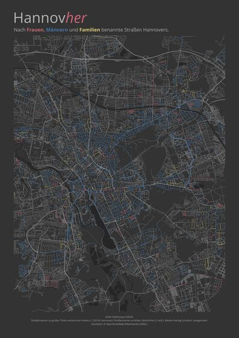

<!--  -->

The city of Hannover, Germany, has [re-evaluated its street names based on a scientific report](https://www.hannover.de/Kultur-Freizeit/Architektur-Geschichte/Erinnerungskultur/ZeitZentrum-Zivilcourage/St%C3%A4dtische-Erinnerungskultur/Wissenschaftliche-Betrachtung-von-namensgebenden-Pers%C3%B6nlichkeiten-in-Hannover/17-Stra%C3%9Fen-in-Hannover-sollten-umbenannt-werden) analysing the values embodied by the public figures whose names have been given to streets. In addition, [women who have been important in the city's history](https://www.hannover.de/content/download/221970/file/Bedeutende%20Frauen.pdf) were highlighted as candidates for having a street named after them. Nevertheless, as in many European cities, the gender gap in street names remains clearly visible on the map.

This colour coded map can be generated with R. It can be saved as PNG or PDF in any format. The code is currently optimised for A2 dimensions. In addition to R you will need a bunch of packages and the [Open Sans font](https://fonts.google.com/specimen/Open+Sans) installed on your system.

Christian Hanke's book _Hannovers Straßennamen erzählen Geschichte (2. Aufl.)_, Medien-Verlag Schubert (2014) was invaluable in sorting out the street names, as I was unable to find an official record of the people after whom the streets were named, and as it was sometimes unclear whether the street was named after a person at all.

This is just a small weekend project. However, I am happy to consider corrections, as some cases remained unclear. Feel free to share this project and adapt it to your home town!
